---
## Author
author:
  name: Зубов Иван Александрович
  degrees: DSc
  orcid: 0000-0002-0877-7063
  email: 1132243112s@rudn.ru
  affiliation:
    - name: Российский университет дружбы народов
      country: Российская Федерация
      city: Москва
      address: ул. Миклухо-Маклая, д. 6

## Title
title: "Внешний курс Основы кибербезопасности"
subtitle: "Отчет"
license: "CC BY"
---

# Цель работы

Изучить основы информационной безопасности и закрепить практические навыки прохождения тестовых заданий

# Безопасность сети

## Как работает интернет:базовые сетевые протоколы

HTTPS — это протокол прикладного уровня, который используется для безопасной передачи веб-данных.

{#fig-001 width=70%}

Транспортном — TCP работает на транспортном уровне и отвечает за надежную передачу данных.

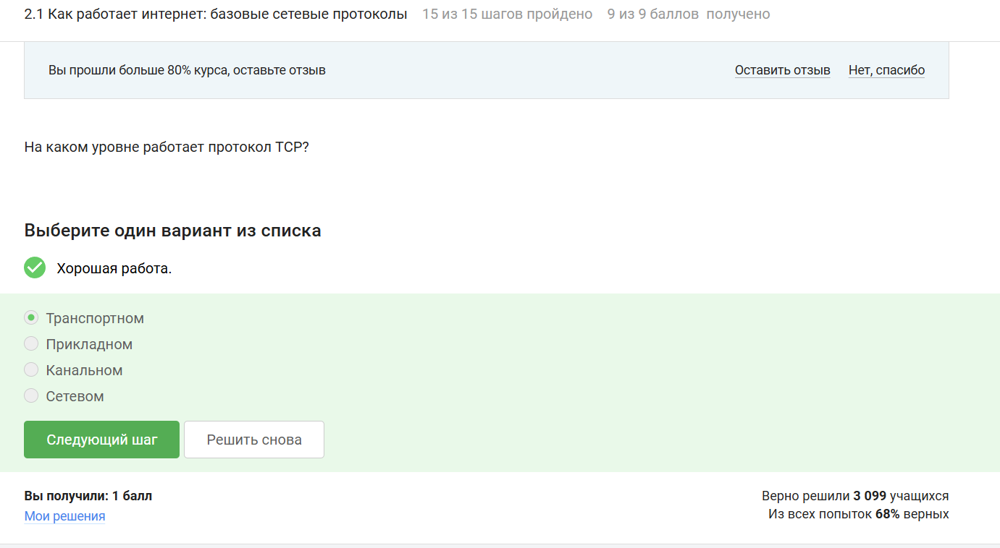{#fig-002 width=70%}

90.11.90.22 и 25.198.0.15 — в IPv4 каждый октет должен быть от 0 до 255, а в первых двух адресах есть числа больше 255.

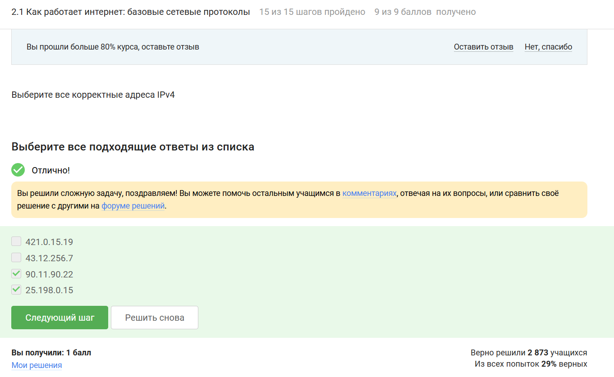{#fig-003 width=70%}

 DNS переводит понятные человеку домены в IP-адреса.

{#fig-004 width=70%}

прикладной → транспортный → сетевой → канальный — это правильный порядок уровней модели TCP/IP сверху вниз.

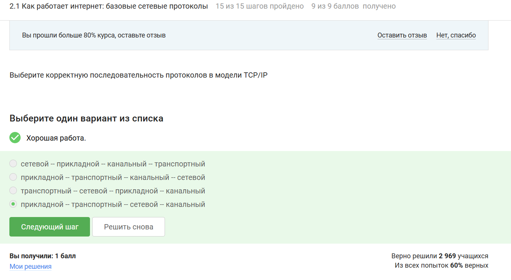{#fig-005 width=70%}

обычный HTTP не шифрует трафик.

{#fig-006 width=70%}

HTTPS сначала устанавливает защищённое соединение, затем передаёт данные.

{#fig-007 width=70%}

и клиентом, и сервером в процессе “переговоров” — версия TLS выбирается обеими сторонами во время handshake.

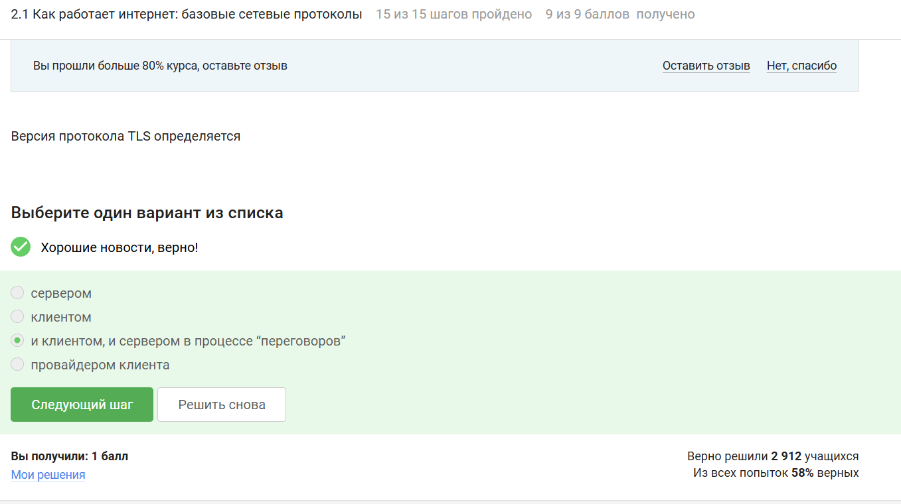{#fig-008 width=70%}

шифрование данных — в фазе рукопожатия TLS только договаривается о ключах и алгоритмах, а само шифрование начинается после неё.

{#fig-009 width=70%}

## Персонализация сети

Куки обычно хранят данные для авторизации и персонализации, но не пароль и не IP.

{#fig-010 width=70%}

 куки нужны для авторизации, персонализации и аналитики, а не для работы сети.

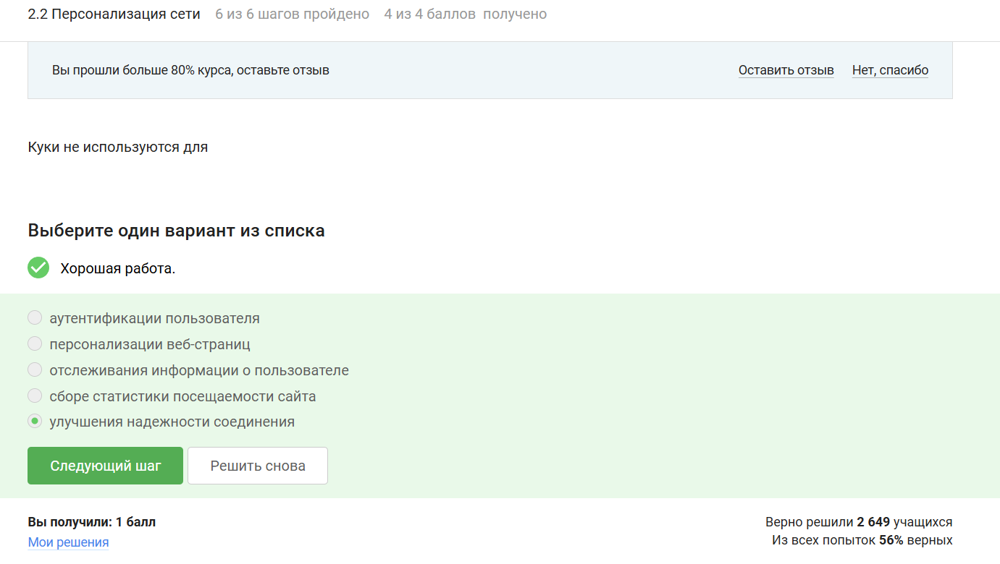{#fig-011 width=70%}

сервером — сервер создаёт cookie и отправляет её браузеру через HTTP-заголовок.

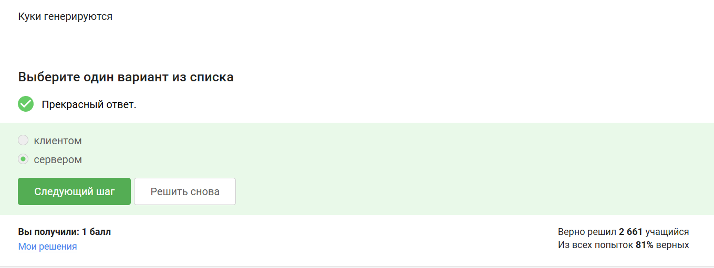{#fig-012 width=70%}

Да, на время пользования веб-сайтом — сессионные куки хранятся до закрытия браузера или завершения сессии.

{#fig-013 width=70%}

## Браузер TOR. Анонимизация

в классической цепочке TOR используются входной (охранный), промежуточный и выходной узлы.

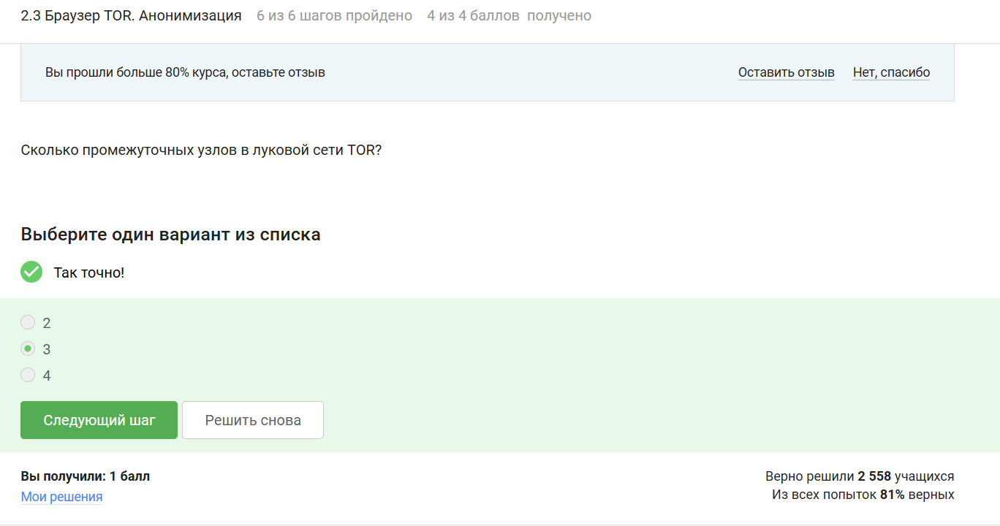{#fig-014 width=70%}

отправителю и выходному узлу — отправитель знает адрес получателя, а выходной узел видит, куда отправляет трафик.

{#fig-015 width=70%}

с охранным, промежуточным и выходным узлом — для каждого узла TOR создаётся отдельный общий секретный ключ.

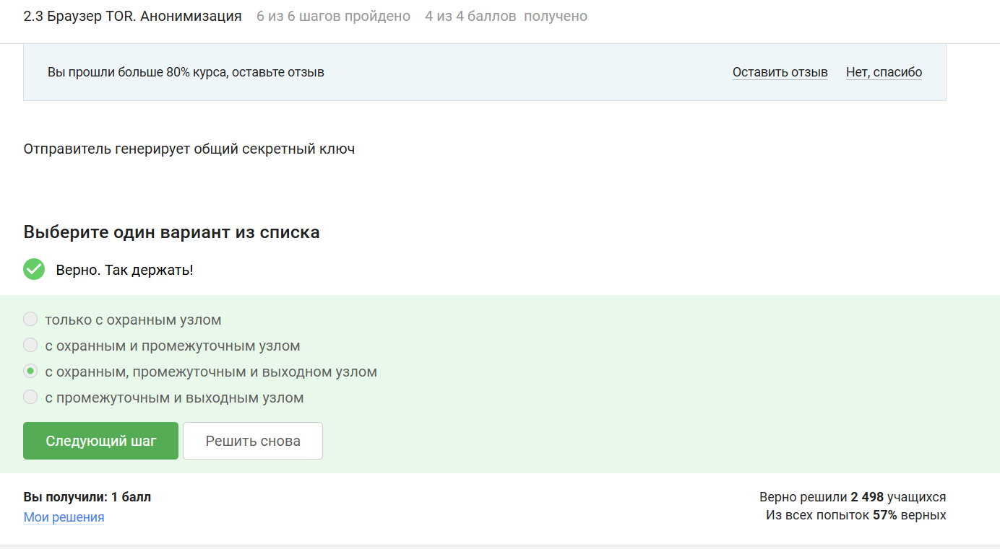{#fig-016 width=70%}

получателю не нужен Tor, потому что для него соединение выглядит как обычный запрос от выходного узла.

{#fig-017 width=70%}

## Беспроводные сети WI-FI

Wi-Fi это стандарт беспроводной передачи данных в локальной сети.

{#fig-018 width=70%}

Wi-Fi работает на канальном уровне модели OSI, обеспечивая передачу кадров по радиоканалу.

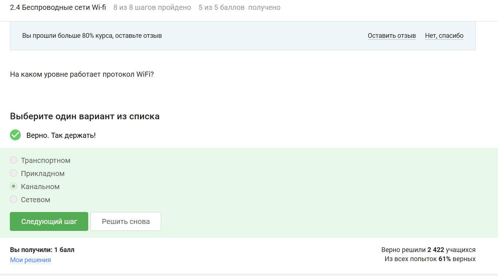{#fig-019 width=70%}

WEP считается небезопасным, потому что его шифрование давно легко взламывается.

{#fig-020 width=70%}

 после проверки доступа Wi-Fi шифрует трафик между устройством и роутером.

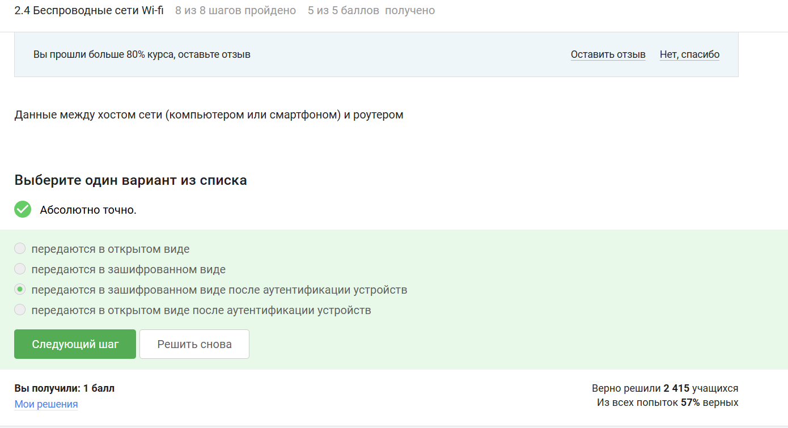{#fig-021 width=70%}

для домашних сетей обычно используют WPA2 Personal с общим паролем Wi-Fi.

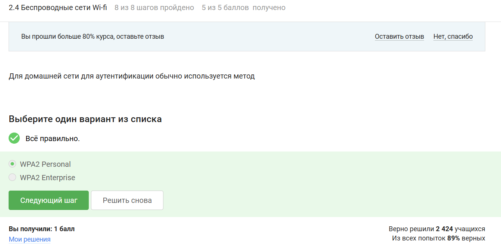{#fig-022 width=70%}

# Защита пк/телефона

## Шифрование диска

 современные системы шифрования диска могут шифровать даже загрузочный сектор и системный раздел.

{#fig-023 width=70%}

 шифрование диска обычно использует один общий ключ для шифрования и расшифровки данных.

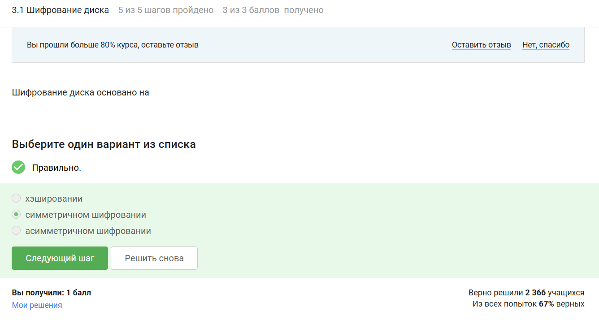{#fig-024 width=70%}

эти программы поддерживают шифрование дисков

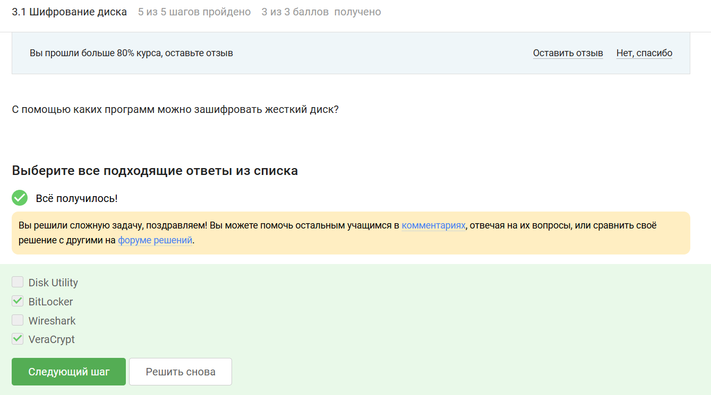{#fig-025 width=70%}

## Пароли

 этот пароль стойкий, потому что содержит буквы разного регистра, цифры и спецсимволы.

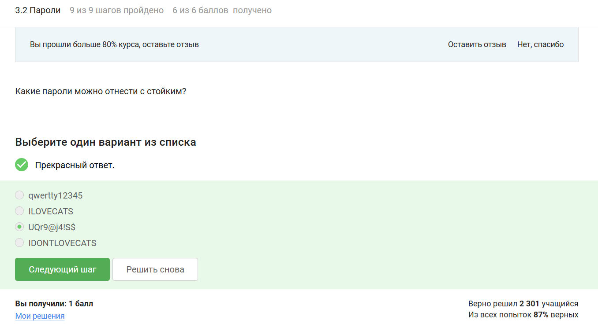{#fig-026 width=70%}

 менеджеры паролей безопасно хранят и шифруют данные для входа.

{#fig-027 width=70%}

 капча помогает отличить человека от бота

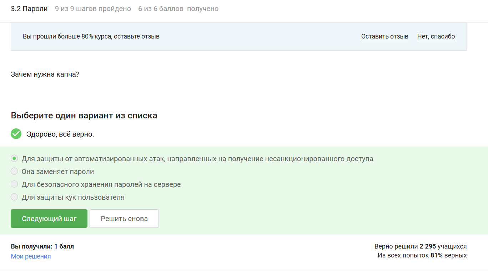{#fig-028 width=70%}

хэширование позволяет хранить только хэш пароля, а не сам пароль.

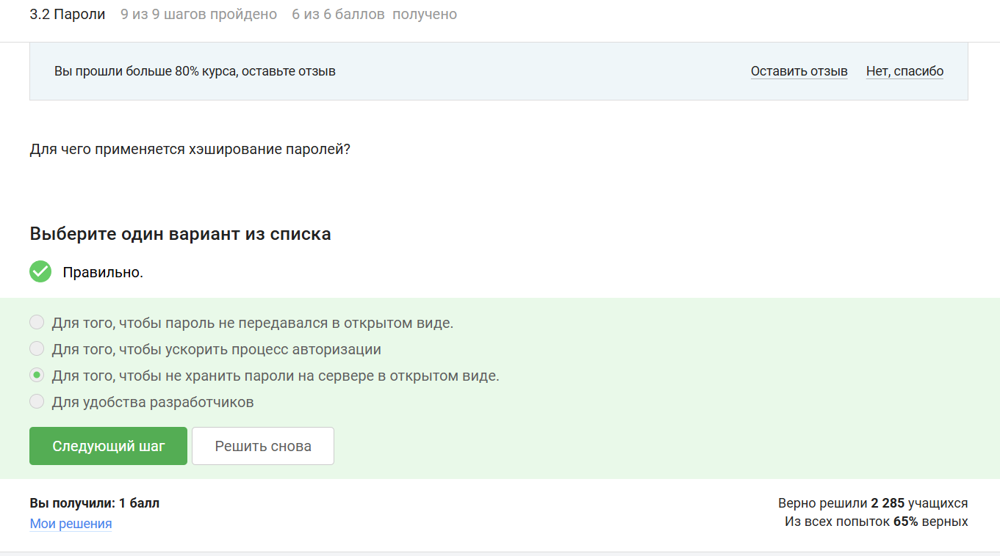{#fig-029 width=70%}

 соль делает одинаковые пароли разными в базе и усложняет перебор и использование радужных таблиц.

{#fig-030 width=70%}

эти меры усложняют автоматический перебор и уменьшают риск взлома аккаунтов.

{#fig-031 width=70%}

## Фишинг

фишинговые письма могут приходить даже с адресов знакомых, если их аккаунт был взломан или подделан.

{#fig-032 width=70%}

 это фишинговые ссылки, потому что настоящие домены Google, Сбербанка и Яндекса здесь подменены (google.com.br, wix.ru, ucoz.ru).

{#fig-033 width=70%}

## Вирусы.Примеры

Email Spoofing это отправка писем с поддельным адресом отправителя.

{#fig-034 width=70%}

троян выглядит как полезная программа, но выполняет вредоносные действия.

{#fig-035 width=70%}

## Безопасность мессенджеров

В протоколе Signal используется Double Ratchet — ключи постоянно обновляются для каждого нового сообщения, что повышает безопасность переписки.

{#fig-036 width=70%}

Сервер участвует в передаче, но не может прочитать содержимое сообщений, потому что расшифровать их могут только отправитель и получатель.

{#fig-037 width=70%}

# Криптография на практике

обе стороны имеют пару ключей — в асимметричной криптографии используются открытый и закрытый ключи.

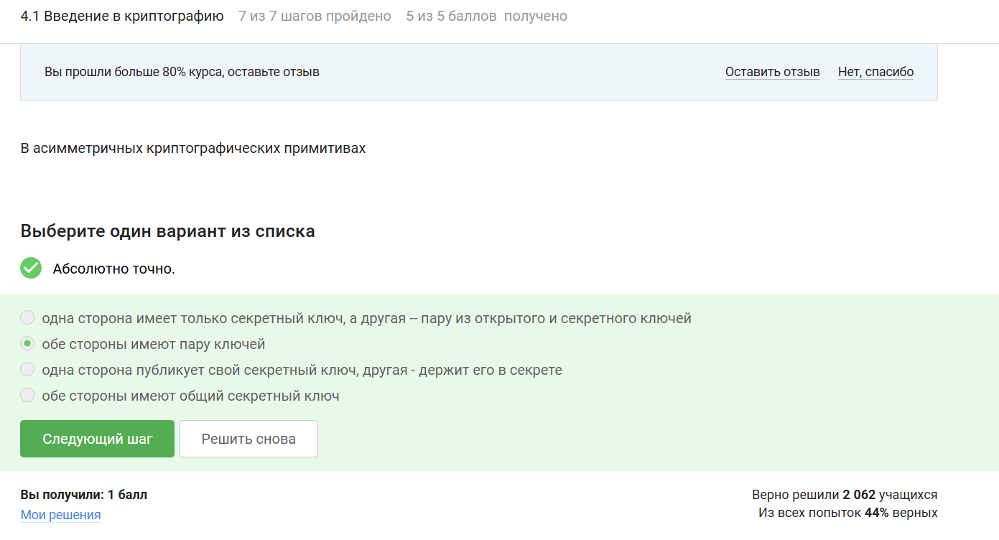{#fig-038 width=70%}

стойкая к коллизиям, эффективно вычисляется, даёт на выходе фиксированное число бит независимо от объёма входных данных — это свойства криптографической хэш-функции.

{#fig-039 width=70%}

RSA, ECDSA, ГОСТ Р 34.10-2012 — это алгоритмы цифровой подписи; AES — шифрование, SHA2 — хэширование.

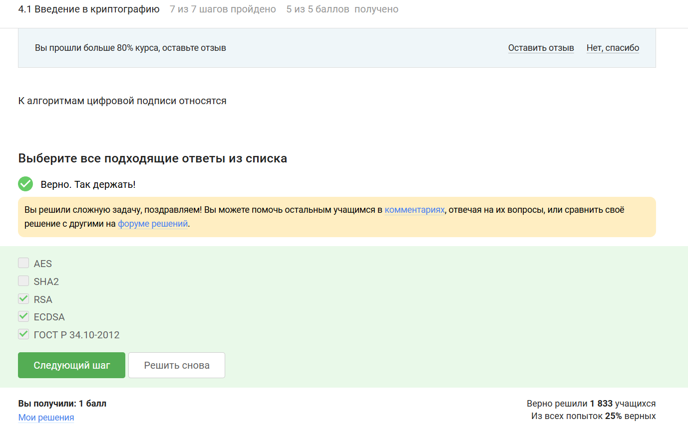{#fig-040 width=70%}

MAC использует общий секретный ключ для проверки целостности и подлинности сообщения.

{#fig-041 width=70%}

асимметричный примитив генерации общего секретного ключа — Диффи-Хеллман позволяет сторонам безопасно выработать общий секрет через открытый канал.

{#fig-042 width=70%}

## Цифровая подпись

ЭЦП использует пару открытого и закрытого ключей.

{#fig-043 width=70%}

 для проверки ЭЦП нужны сама подпись, исходное сообщение и публичный ключ автора.

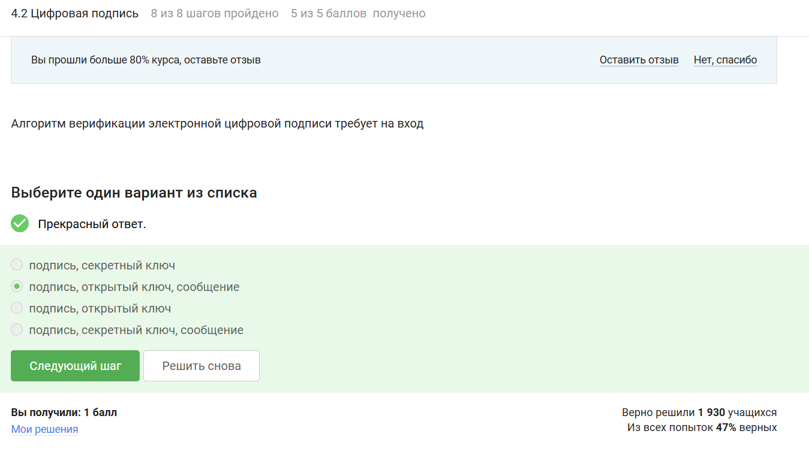{#fig-044 width=70%}

ЭЦП подтверждает автора и целостность данных, но не шифрует информацию.

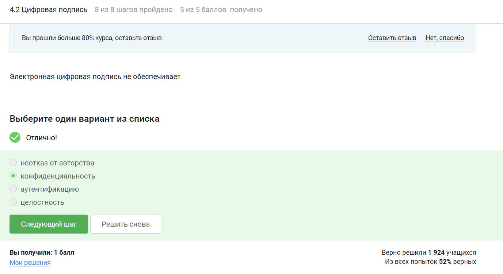{#fig-045 width=70%}

для отправки налоговой отчётности в ФНС требуется именно такой тип подписи.

{#fig-047 width=70%}

квалифицированные сертификаты ЭЦП выдаются аккредитованными УЦ.

{#fig-047 width=70%}

## Электронные платежи

MasterCard, МИР — это реальные платёжные системы; POS-терминал и банкомат — устройства, а SecurePay — не стандартная система.

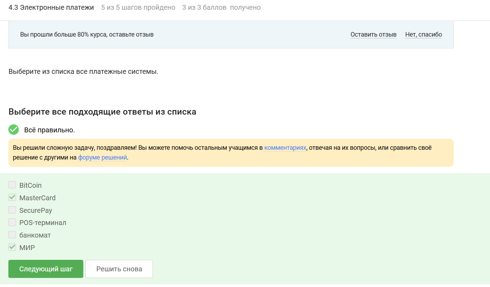{#fig-048 width=70%}

комбинация проверка пароля + код в SMS сообщении, комбинация код в SMS сообщении + отпечаток пальца — это многофакторная аутентификация, потому что используются разные факторы подтверждения.

{#fig-049 width=70%}

онлайн-платежи сейчас обычно подтверждаются через 3D-Secure с несколькими факторами.

{#fig-050 width=70%}

## Блокчейн

сложность нахождения прообраза — в Proof of Work важно, что подходящий хэш очень трудно подобрать.

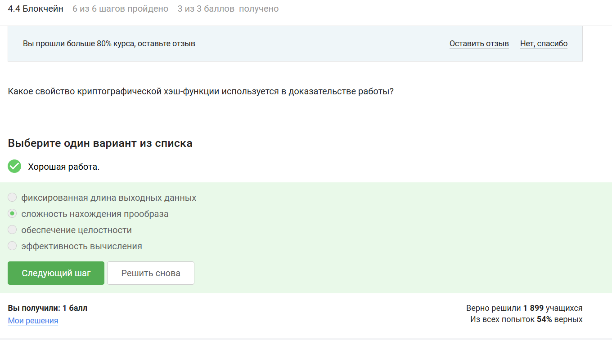{#fig-051 width=70%}

это свойства консенсуса в блокчейне.

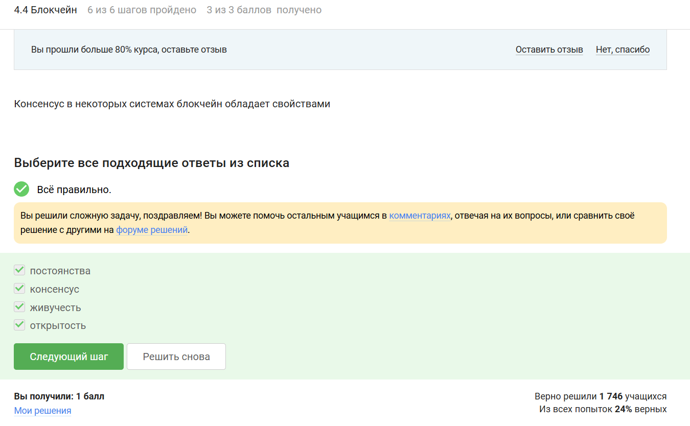{#fig-052 width=70%}

цифровая подпись — участники блокчейна хранят секретные ключи именно для подписи транзакций.

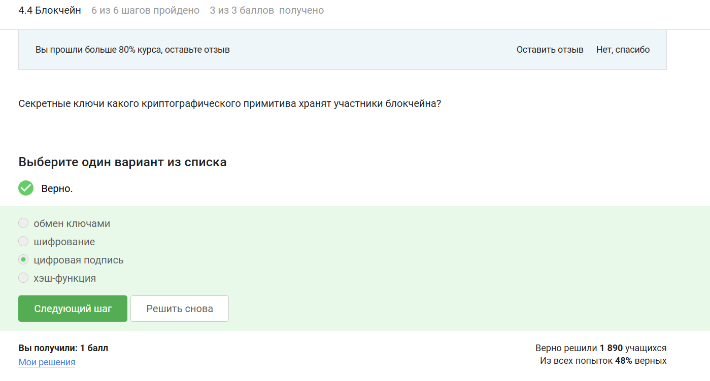{#fig-053 width=70%}

## Финал

Самого серитификата не было,поэтому приложу фото прохождения курса. В скринкасте можно увидеть мое полное прохождение.

{#fig-054 width=70%}

# Выводы

В ходе работы были выполнены успешно все тестовые задания. Я закрепил практические навыки по основам информационной безопасностти

